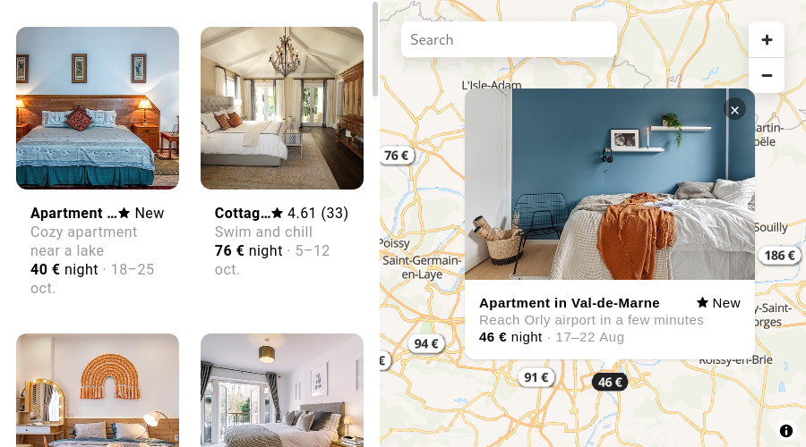

# booking-map-example

This project is a part of our use case showcase.

## [Live Demo](https://jawg.github.io/booking-map-example/)



## Run the example locally

### Requirements

- A Jawg Lab account: You can sign up for a Jawg account here: https://www.jawg.io/lab
- A Jawg access-token: Available in Jawg Lab: https://www.jawg.io/lab/access-tokens

### Installing the example

1. Clone the repository

```bash
git clone git@github.com:jawg/booking-map-example.git
cd booking-map-example
```

2. Create a `.env` file and add your access token.

```bash
JAWG_ACCESS_TOKEN=YOUR_ACCESS_TOKEN
```

3. Install all required packages and start the server.

```bash
npm install
npm start
```

Go to the URL: http://localhost:8000

### Update the example

You will see the precense of the constant named `DYNAMIC_DATA_SOURCE`, this allows you to switch between two uses cases, the static data source and dynamic one. By default you are using the static one.

The dynamic datasource is useful when you have a webservice that serves your data. You will need to update the function `dynamicSourceUpdateCallback` and set `DYNAMIC_DATA_SOURCE` to `true`.
